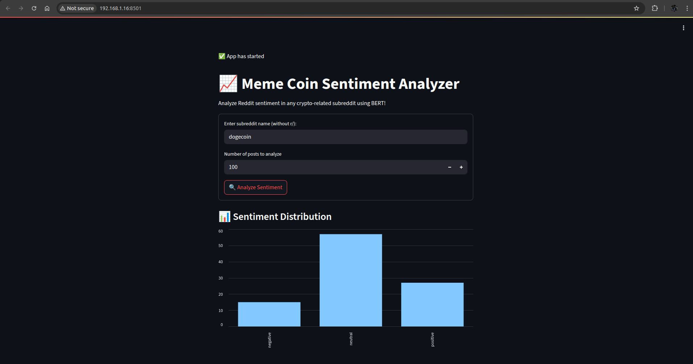
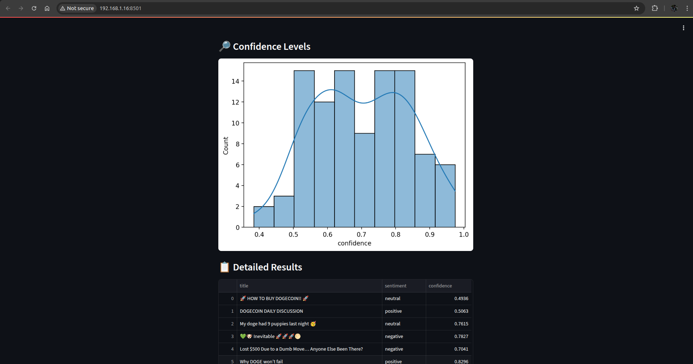

# 🧠 Meme Coin Sentiment Analyzer

Analyze public sentiment of meme coins using Reddit discussions and BERT-based sentiment classification.




---

## 🚀 Features

- 🔍 Live Reddit Scraper (via PRAW)
- 🤖 Sentiment Analysis using `cardiffnlp/twitter-roberta-base-sentiment`
- 📊 Streamlit Interface with charts and confidence histograms
- 📁 Clean architecture & fully open-source

---

## 🛠 Installation

### 1. Clone the repo
```bash
git clone https://github.com/DreamWalker101/meme-coin-sentiment-analyzer.git
cd meme-coin-sentiment-analyzer
```

### 2. Create & activate a virtual environment (optional but recommended)
```bash
python3 -m venv venv
source venv/bin/activate  # on Linux/macOS
venv\Scripts\activate   # on Windows
```

### 3. Install dependencies
```bash
pip install -r requirements.txt
```

---

## 💻 Running the App

```bash
streamlit run app.py
```

Then open [http://localhost:8501](http://localhost:8501) in your browser.

---

## 📂 File Structure

```
.
├── app.py                      # Main Streamlit app
├── meme_sentiment_experiment.ipynb  # Notebook version (for testing)
├── requirements.txt
├── Assets/
│   ├── ss1.png
│   └── ss2.png
└── README.md
```

---

## 🤝 Contributing

Pull requests are welcome. Feel free to open an issue to discuss major changes before starting work.

---

## 📝 License

This project is licensed under the MIT License.
